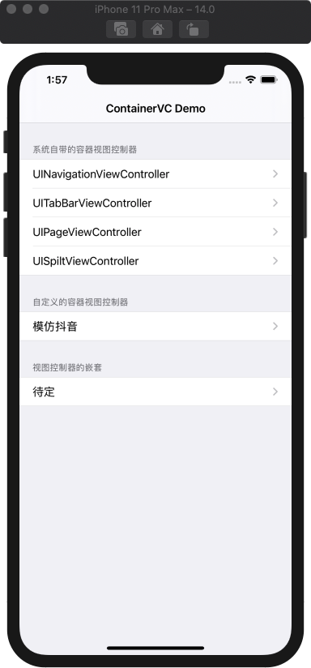

# 容器视图控制器

Important: Read [View Controller Programming Guide for iOS](https://developer.apple.com/library/archive/featuredarticles/ViewControllerPGforiPhoneOS/index.html#//apple_ref/doc/uid/TP40007457-CH2-SW1) for anything you want to know about View Contorller

### 0x00 系统自带的容器视图控制器

如下图所示，本Demo中使用纯代码的方式创建了UINavigationController、UITabBarController、UISplitViewController和UIPageViewController的示例

文档链接：

* [UINavigationController](https://developer.apple.com/documentation/uikit/uinavigationcontroller?language=objc)
* [UITabBarController](https://developer.apple.com/documentation/uikit/uitabbarcontroller?language=objc)
* [UISplitViewController](https://developer.apple.com/documentation/uikit/uisplitviewcontroller?language=objc)
* [UIPageViewController](https://developer.apple.com/documentation/uikit/uipageviewcontroller?language=objc)

### 0x01 自定义的容器视图控制器

如下图所示，本Demo模仿抖音的首页，实现了一个自定义的容器视图控制器

上方的按钮点击可以切换视图，下方的按钮暂时未做功能实现，原理同上方按钮

文档链接：

* [Implementing a Container View Controller](https://developer.apple.com/library/archive/featuredarticles/ViewControllerPGforiPhoneOS/ImplementingaContainerViewController.html#//apple_ref/doc/uid/TP40007457-CH11-SW1)

### 0x02 容器视图控制器的嵌套

待定

### 0x03 聊一聊视图控制器

##### VC作用

1.每一个VC都有一个视图层级树，VC主要负责管理这个视图层级树，每一个VC都有一个RootView，所有的视图添加操作，都是添加到这个RootView里              

2.VC还负责Model和View之间的连接，把Model喂给View，使View展示出用户想看到的数据               

##### VC类别
1.Content View Controller: 我们大多数时间创建的VC，自己管理其所有的视图

2.Container View Controller: 里面有很多个ChildVC，用于页面切换和导航，Container VC仅管理自己的RootView和所有ChildVC的RootView，但ChildVC的视图层级树由ChildVC自己管理，Container VC只是给这个ChildVC的RootView划分区域
UIKit有一些自带的Container VC，比如UINavigationController、UITabBarController、UISplitViewController和UIPageViewController
但我们也可以自定义一个我们想要但Container VC

下图以`UISplitViewController` 为例展示Container VC如何管理其Child VC               VC层次结构当应用只有单个页面的Content VC此时root VC就是这个Content VC               当应用只有单个页面的Container VC此时root VC就是这个Container VC，但这个Container VC管理着其下的所有Child VC，由所有Child VC去组成这个Container VC的视图               跳到一个新的VC比如用户点击一个按钮跳到一个新页面，此时新的VC会覆盖住原有的视图，但被覆盖但视图是否需要被销毁取决于开发者，可以销毁也可以保留住

​             

